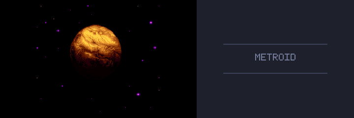
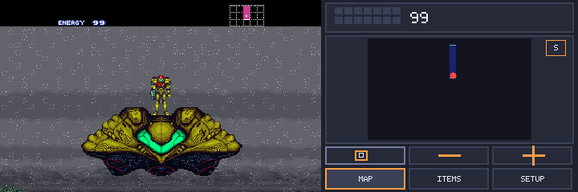
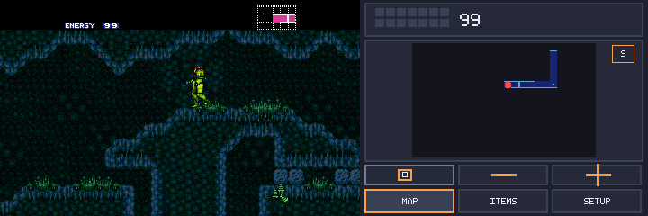
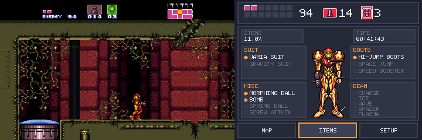
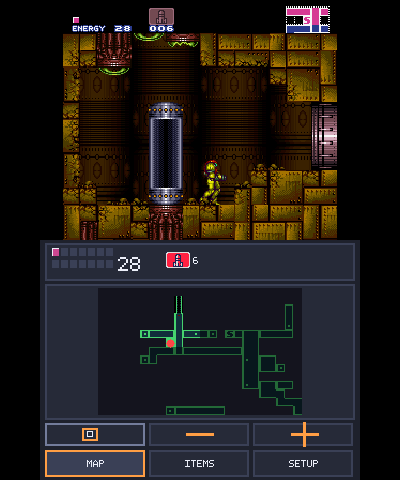

# sm-3ds-native

[Español](README.es.md) · [Downloads](https://github.com/NicolasBeatum/sm-3ds-native/releases/latest) · [Changelog](CHANGELOG.md)

> [!IMPORTANT]
> **Unofficial port developed with extensive AI assistance.** NicolasBeatum directs and tests this project; OpenAI Codex has been used for analysis, implementation, debugging, optimization and documentation. Choosing not to play this port because it uses AI is completely understandable and respected. This is not an official release from Nintendo or any upstream project.

A Nintendo 3DS port of Super Metroid, based on [CharlesAverill/sm-3ds](https://github.com/CharlesAverill/sm-3ds) and the [snesrev PC port/decompilation](https://github.com/snesrev/sm), with a MetroidArch-inspired companion screen.

## Current status

**Playable, but still under development.** NicolasBeatum has not yet completed a full playthrough or 100% completion with this port. We cannot confirm that the game can be finished from beginning to end; later areas, bosses or the ending may still have issues. Performance varies with the console, room, effects and widescreen setting; 60 FPS is a target, not a guarantee.

The same packages run on Old and New 3DS. New 3DS automatically enables its faster CPU clock and L2 cache. The game image, palette, stereo audio and gameplay are preserved by the optimization work.

## Screenshots

Captured in **Azahar**; these screenshots do not establish performance on real hardware. They include both vertically stacked and side-by-side LCD layouts.

| Intro | Landing Site |
| --- | --- |
|  |  |
| Caves and map | Equipment screen |
|  |  |

## Features

- Native game logic and stereo 32 kHz audio.
- PICA200 rendering for supported Mode 1 frames, with an exact CPU fallback for unsupported state or mid-frame changes.
- Optional widescreen with extended scenery, sprites, HDMA lighting and camera shake.
- Live lower-screen energy/ammo status, equipment, Redux suit illustration, item percentage and play time.
- Area and world maps with touch dragging, zoom, Samus centering/following, area-name toggling and map markers. SETUP can hide the floating buttons.
- Separate status-bar switches for MAP, ITEMS and SETUP; widescreen and main-HUD preferences persist on the microSD card.
- Startup ROM selector, per-ROM saves and compatibility checks for the Klint/Pacochan Spanish 1.0 translation. The launcher does not apply IPS patches yet.
- **SETUP → i** shows the detected Old/New 3DS hardware family and build information, and provides **SAVE DUMP**. Dumps also work with **L + R + A** and are grouped in timestamped folders.
- Diagnostics include full-session and recent frame timings, separate standard/widescreen gameplay statistics, WRAM/SRAM and LCD captures when available.
- Animated Samus/ship HOME Menu banner and a three-second opening music excerpt for the CIA; the small HOME icon is retained.

## Building / download

**To play, download the ready-to-install builds from [Releases](https://github.com/NicolasBeatum/sm-3ds-native/releases/latest).** Version [0.1.3](https://github.com/NicolasBeatum/sm-3ds-native/releases/tag/v0.1.3) includes:

- `.3dsx` and `.smdh` for Homebrew Launcher.
- `.cia` for installation with FBI.
- A QR code for **FBI → Remote Install → Scan QR Code**.

Supply your own compatible `.smc` or `.sfc` ROM in `sdmc:/3ds/sm3dsnative/` and select it at startup. The directory is created automatically; saves go in `saves/`, settings in `settings.cfg`, and diagnostic captures in `dump/<timestamp-id>/` under that same directory. Neither build contains a game ROM or translation patch. Previously saved games and settings remain usable when updating.

For compilation instructions, translation setup and diagnostic details, see [Building and diagnostics](docs/BUILDING.md). For the architecture and verification history, see [Porting notes](docs/PORTING_NOTES.md).

## Provenance and AI disclosure

This repository is a custom integration of several independent projects; it is
not presented as wholly original work:

| Project | Role in this repository |
| ------- | ----------------------- |
| [CharlesAverill/sm-3ds](https://github.com/CharlesAverill/sm-3ds) | Nintendo 3DS port base. |
| [CharlesAverill/sm-3ds-lib](https://github.com/CharlesAverill/sm-3ds-lib) | Native game/decompilation submodule used by the port. |
| [snesrev/sm](https://github.com/snesrev/sm) | Original Super Metroid decompilation/PC port ancestry. |
| [libsdl-org/SDL](https://github.com/libsdl-org/SDL) | Platform, input and audio layer. |
| [Raekwon1603/RetroArch `metroidarch-dual-screen`](https://github.com/Raekwon1603/RetroArch/tree/metroidarch-dual-screen) | Lower-screen design reference and source of derived UI code, ROM decoding behavior and Redux suit data. |
| [EstebanPdN/zelda-alttp-3ds](https://github.com/EstebanPdN/zelda-alttp-3ds) | Reference for dump organization and session performance diagnostics. |

The lower-screen implementation and bundled Redux suit data are derived from
the GPL-3.0 MetroidArch branch. The combined port is distributed under GPL-3.0;
the CharlesAverill MIT notice remains in `LICENSE.MIT`, and the original
licenses of the submodules remain in their own repositories. See
`THIRD_PARTY_NOTICES.md` for file and asset provenance. The Redux suit bytes
were extracted from a modified game ROM; the GPL notice on the MetroidArch
code does not establish ownership of those graphics.

The port uses public submodule forks
[`NicolasBeatum/sm-3ds-lib-native-fork`](https://github.com/NicolasBeatum/sm-3ds-lib-native-fork)
and [`NicolasBeatum/SDL-3DS-native-fork`](https://github.com/NicolasBeatum/SDL-3DS-native-fork).
Their fork relationships identify the original projects; the branches pinned
in `.gitmodules` contain the 3DS-specific changes.

OpenAI Codex has been used extensively throughout this custom fork. AI-assisted
work includes implementation drafts, source comparison, performance analysis,
the PICA200 and lower-screen integration, bug diagnosis, test automation and
documentation. Human direction, acceptance testing and the decision to publish
remain with the repository owner. AI assistance does not change the licenses,
copyright or required attribution of any upstream project.

If you prefer not to play a port developed with AI assistance, that choice is completely understandable and respected. The disclosure is here so you can make an informed decision.
